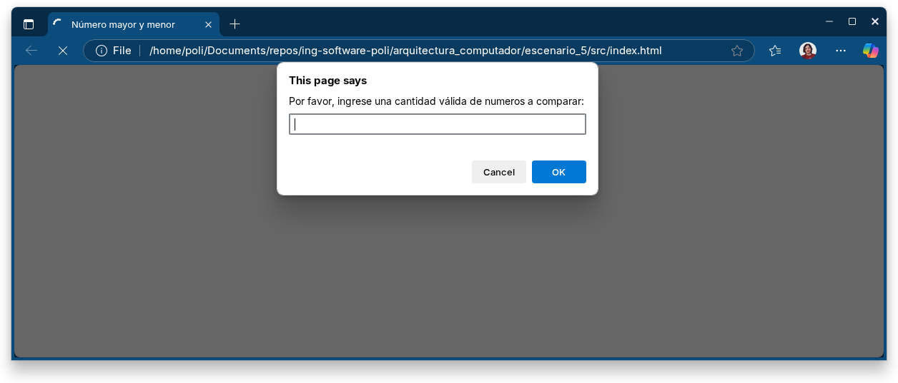

# Introducción

Se presenta versión en JavaScript del ejercicio realizado en Assembly donde se obtenía el número mayor y menor de una lista de números ingresados por el usuario.

# Ejecución

Para ejecutar la aplicación, abra el archivo [index.html](src/index.html) en el navegador Web de su preferencia y debería ver algo como lo siguiente:

1. Ingresar cantidad de números a solicitar.

2. Ingresar números uno por uno. 

3. Muestra número mayor y menor.

